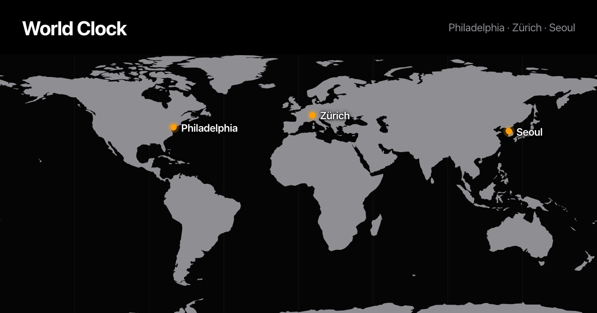

# World Clock — Philadelphia · Zürich · Seoul

Local time in three cities on one day/night map, in the style of the macOS Clock app.

**→ https://heyludy.github.io/worldclock/**



## What it does

- **Day/night map.** A real solar terminator, recomputed every second from the sun's
  actual position, so you can see at a glance who is awake.
- **Analog + digital clock per city.** The dial turns dark wherever the sun has set,
  the way the Clock app does it.
- **Relative to you.** Each city shows `Today / Yesterday / Tomorrow` and its offset in
  hours against whatever time zone your own device is in.
- **Sunrise and sunset**, computed per city per day.
- **Find a time.** Drag the slider ±24 hours and all three clocks, the map and the
  dials move together. Times snap to the nearest ten minutes, so you always land on
  `x:00`, `x:10`, `x:20` — something you can actually propose to people.
- **Overlap band.** The slider track is painted green across every stretch where all
  three cities are inside waking hours, so the workable slots are visible without
  hunting for them, and a line above says who is currently asleep.
- **Shareable moment.** Move the slider and the address bar picks up
  `?t=2026-08-20T13:00Z`. Opening that link pins the page to exactly that instant for
  everyone, whatever time zone they are in — the clocks stop tracking the wall clock
  and `Now` puts them back.
- **Copy.** One tap puts a paste-ready block on the clipboard:

  ```
  Philadelphia — Thu Aug 20, 9:00 AM
  Zürich — Thu Aug 20, 3:00 PM
  Seoul — Thu Aug 20, 10:00 PM
  https://heyludy.github.io/worldclock/?t=2026-08-20T13:00Z
  ```

- **12h / 24h toggle**, remembered in `localStorage`.
- Daylight saving is handled automatically — the page reads the browser's IANA
  time zone database rather than storing any offsets of its own.

## Structure

A single `index.html`. No build step, no dependencies, no network calls. Open the file
directly in a browser and it works.

The world map is a Natural Earth 1:110m land outline (public domain), projected to
equirectangular, simplified with Douglas–Peucker, and inlined as one SVG path. Rings
that cross the antimeridian are unwrapped and redrawn at ±360° so nothing smears across
the map.

## Changing the cities

Edit the `CITIES` array in `index.html`. Coordinates drive the map pin and the
sunrise/sunset math, so both are needed.

```js
var CITIES = [
  { key: "phl", name: "Philadelphia", tz: "America/New_York", lat: 39.9526, lon: -75.1652, side: "right" },
  { key: "zrh", name: "Zürich",       tz: "Europe/Zurich",    lat: 47.3769, lon:   8.5417, side: "right" },
  { key: "sel", name: "Seoul",        tz: "Asia/Seoul",       lat: 37.5665, lon: 126.9780, side: "left"  }
];
```

- `tz` — an [IANA time zone name](https://en.wikipedia.org/wiki/List_of_tz_database_time_zones).
- `side` — which way the label hangs off the map pin, `"left"` or `"right"`. Use `"left"`
  for cities near the right edge of the map so the label stays on screen.

What counts as "awake" for the green band is the `AWAKE` constant just above `CITIES`:

```js
var AWAKE = { from: 8, to: 23 };   // local hours, applied to every city
```

## Deploying

Push to `main`; GitHub Pages publishes from the repository root.
